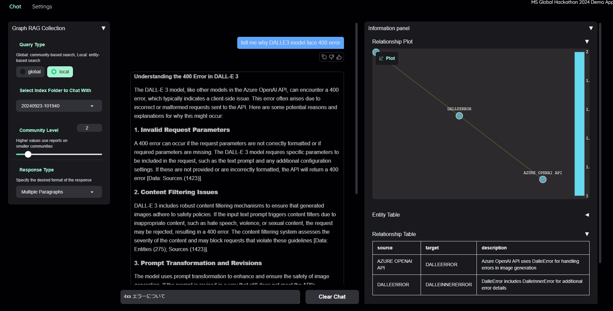
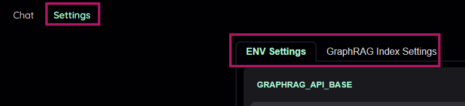
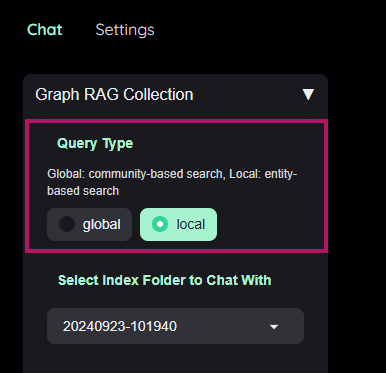
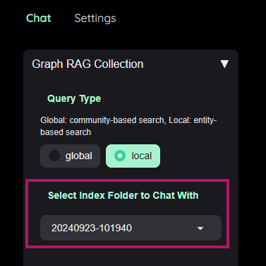
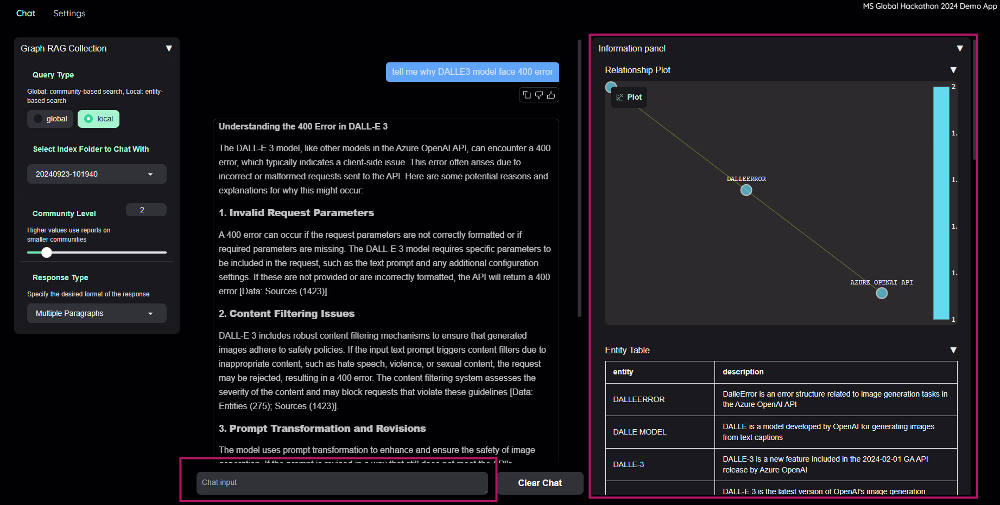

# 🎉 GraphRAG-SimpleUI-Builder: Advanced Data Search and Visualization 🎉

For this project, I created a simple tool to try out [GraphRAG](https://microsoft.github.io/graphrag/) more concisely for internal Hackathon.
Feel free to play around with it and customize it to your liking😄

**This UI is influenced by the design of the [kotaemon](https://github.com/Cinnamon/kotaemon.git) and [GraphRAG-Local-UI](https://github.com/severian42/GraphRAG-Local-UI.git) tool (I thought it was such a beautiful app!).*



### 🚀 Background: What Is This Project About?

Welcome to **GlobalHack-GraphRAG-SimpleUI**, a project that I created for the Hackathon Project!
The goal was simple: make it super easy for beginners to perform complex data searches and visualize results, using the power of **Microsoft’s GraphRAG technology**.

Feel free to tweak it, expand on it, or improve it in your own way. Whether you're looking to personalize your search flow or just want to make things faster, go ahead and make this tool your own! 🙌

### 🔑 Key Features

Here are the awesome things this tool can do:

- **✨ User-friendly Interface**:
The Gradio UI is intuitive, making it easy to select queries, browse the GraphRAG index, and input your questions.
<br>

- **🔍 Enhanced Search Modes**:
  - **Global Search**: Great for broad, overarching queries.
  - **Local Search**: Perfect for when you need to dive deep into specific data points.
<br>

- **⚡ GraphRAG Integration**:
GraphRAG doesn’t just rely on simple text matching. It builds a knowledge graph to help understand relationships between data points—making it much smarter for answering complex questions.


### 🎯 How To Get Started

Let’s get you up and running! Just follow these simple steps:

1. Install Python (version >= 3.12).
2. Open your terminal and run: `python -m venv .venv`.
3. Activate the environment with: `.venv/Scripts/Activate`.
4. Install the required packages: `pip install -r requirements.txt`.
5. Install GraphRAG from GitHub:
    ```bash
    pip install "git+https://github.com/severian42/GraphRAG-Local-UI.git@c7dea8388d55a035a524676d8d9a6036f934b6c6#egg=graphrag&subdirectory=graphrag"
    ```
6. Finally, run the app: `python app.py`.


### 🎮 How to Use the UI: Step-by-Step Guide

This section will walk you through how to interact with the Gradio interface and utilize the various search modes effectively.

1. **Open the Application**:
   Once you have the app running (`python app.py`), open your browser and you will see the Gradio interface.

2. **Update Settings & Download Index**:
   If needed, you can update the GraphRAG settings directly via the UI or download a fresh index from *Azure BlobStorage* for the most up-to-date content.
   

3. **Select Query Type**:
   Start by choosing your query type from the dropdown menu:
   - **Global Search**: Best for general, broad questions. Select this if you want a wide search across all indexed documents.
   - **Local Search**: Use this when you need a more focused search on specific documents or entities.
   

4. **Browse the GraphRAG Index**:
   Navigate through the available GraphRAG index folders to find the dataset you want to query. You can browse through the content of the indexed files here.
   

6. **Input Your Query**:
   Enter your question or search term in the input box. This can be anything from a general question to a specific search term you need answers for.

7. **Check Your Results**:
   Once the search is processed, the results will appear on the interface. If you're running a **Global Search**, you'll get a comprehensive overview. For **Local Search**, you'll get more focused and detailed results.



## 🎨 Hackathon Context: Why I Built This

This project was for the **Global Hackathon Project**. It’s all about showcasing how powerful Microsoft’s GraphRAG can be for solving complex queries. It’s open-source, so you can customize it however you like—whether you’re tweaking the search options or adding new features.


## 🙌 Join the Fun!

Ready to dive in? Fork the project, experiment, and make something amazing. Let’s see how far we can take **GraphRAG-SimpleUI-Builder** together!

