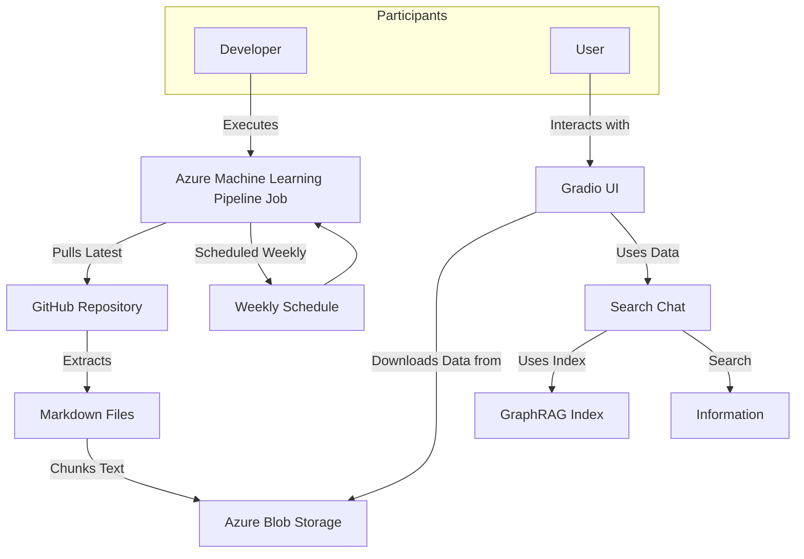

```mermaid
flowchart TD
    subgraph Participants
        A[Developer]
        F[User]
    end
    A -->|Executes| B[Azure Machine Learning Pipeline Job]
    B -->|Pulls Latest| C[GitHub Repository]
    C -->|Extracts| D[Markdown Files]
    D -->|Chunks Text| E[Azure Blob Storage]
    F -->|Interacts with| G[Gradio UI]
    G -->|Downloads Data from| E
    G -->|Uses Data| H[Search Chat]
    H -->|Uses Index| I[GraphRAG Index]
    H -->|Search| J[Information]
    B -->|Scheduled Weekly| K[Weekly Schedule]
    K --> B
```
