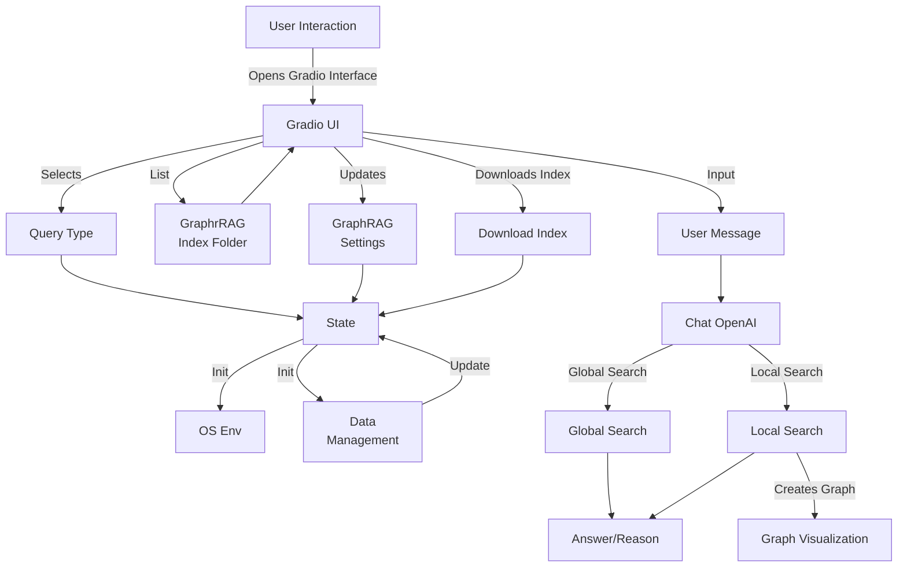

```mermaid
flowchart TD
    A[User Interaction] -->|Opens Gradio Interface| B[Gradio UI]
    %% A --> F[Logging]
    %% B -->C[StateModel]
    C -->|Init| D[OS Env]
    C -->|Init| G[Data
                    Management]

    B -->|Selects| H[Query Type]
    H --> C[State]
    B -->|List| I[GraphrRAG
                    Index Folder]
    B -->|Input| J[User Message]
    J -->K[Chat OpenAI]

    K -->|Global Search| L[Global Search]
    M -->|Creates Graph| O[Graph Visualization]
    L -->S[Answer/Reason]
    K -->|Local Search| M[Local Search]
    M --> S

    %% C --> T[GradioState Interface]
    %% T --> C
    %% J --> T
    %% T --> J

    B -->|Updates| P[GraphRAG
                        Settings]
    P --> C
    B -->|Downloads Index| Q[Download Index]
    Q -->C

    G -->|Update| C
    I -->B
```
